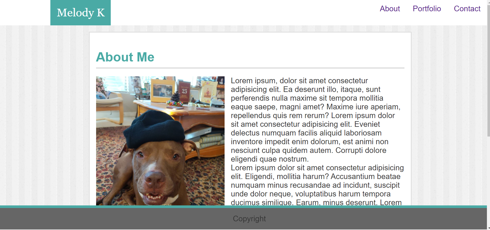
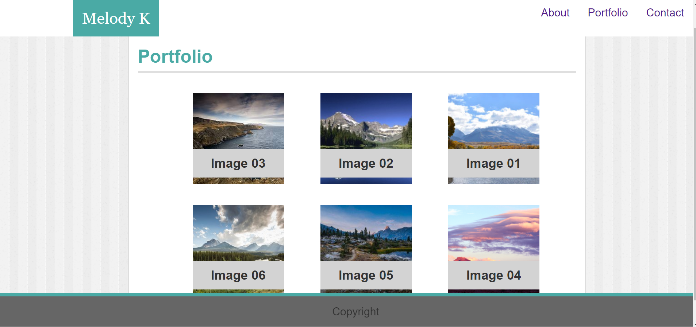
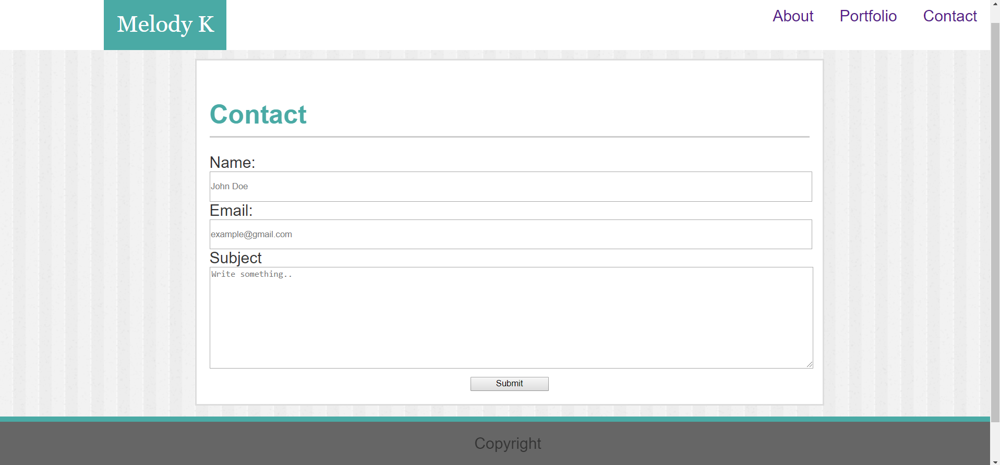

# My Portfolio
## Description
A simple portfolio page designed to demonstrate my first week of learning CSS and HTML and implementing it into a working example. 

## Table of Contents
* [Installation](#installation)
* [Technologies-Libraries](#technologies-libraries)
* [Demo](#demo)
* [Credits](#credits)

## Installation
In your terminal type:
```git clone https://verlitas.github.io/My-Portfolio/```
* Open in Visual Studio to build and run.
* For further instructions, visit https://help.github.com.

## Technologies-Libraries
CSS - HTML - Git

## Demo




Live link: https://verlitas.github.io/My-Portfolio/

## Credits
[Melody Kirshberg](https://github.com/verlitas)  
[UABootCamp](https://bootcamp.ce.arizona.edu/coding/)
